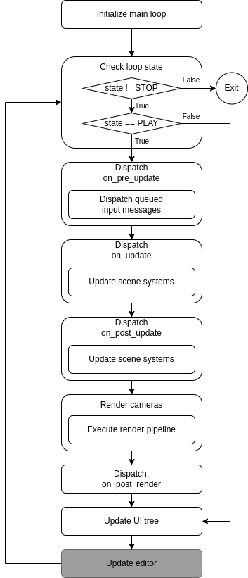

## Project Structure

```
~/CekhmetProjects/my_project
    -> my_project.sekproj           (Json config file for the project containing, among other things, path to the engine install dir and list of plugin & asset package sub-projects)
    -> config                       (Directory containing "documents" of the config registry other than the build config)
        -> editor.json              (Config "document" containing project-specific editor settings, such as the current layout, )
        -> my_plugin_config.json
        -> ...
    -> assets                       (Directory containing project-specific asset packages & asset package sub-projects)
        -> external_pack.sekpak     (External asset package which is not a sub-project, but is still loaded by the engine accorging to the project config)
        -> my_package_a             (Each package receives it's own sub-directory)
            -> .manifest            (Json config file containing information about the package. If the package is a sub-project, will contain extra info about said sub-project)
            -> .editor              (Directory containing editor-specific assets)
                -> assets...
            -> .import-cache        (Directory containing asset import cache, mainly consisting of asset aliases and other import artifacts)
                -> artifacts...
            -> assets...
    -> plugins                      (Directory containing plugin sub-projects)
        -> my_plugin                (Each plugin receives it's own sub-directory)
            -> CMakeLists.txt       (CMake project file of the plugin's sub-project)
            -> CMakeGenerated.txt   (CMake file containing configuration generated by the engine for each project, must be included by CMakeLists.txt)
            -> project sources...
    -> bin                          (Directory containing compiled binaries of the plugin sub-projects)
        -> editor                   (In-editor binaries with debug information and editor-specific functionality)
        -> debug                    (Export binaries with debug information)
        -> release                  (Export binaries with no debug information)
```

### Notes

* Per-build-type subdirectories of `bin` are further separated into target-specific subdirectories,
  ex. `bin/release/win-x64`, `bin/release/linux-x64`, etc.
* Engine initiates automatic hot-reload of plugins once any of the binary directories is modified. This can happen due
  to re-compile of plugin projects from within the editor, as well as external modification.
  Once hot-reload is initiated, the engine closes any open resources (including the render pipeline resource, this
  involves a temporary pause in any viewprt rendering), unloads all currently loaded plugins and effectively
  soft-restarts. This is needed to make sure no plugin-dependant code or memory is left referenced by the engine to
  avoid corruptions and/or crashes.

## Build

There are 3 build types: editor, debug & release.
Plugins built from within the editor are always built using the `editor` build type. This build type includes debug
symbols, editor-only assets, and extra compile definitions such as `SEK_EDITOR`.
Plugins built for export can be either built in debug or release mode. Debug mode includes debug symbols and debug-only
assets. Release mode is fully-stripped and only contains release mode assets.

Users cannot add/remove build types, as the engine only recognizes and is able to use these 3, however they can
configure properties of these build types, such as adding compile definitions and modifying cmake and compiler flags.
In addition, users can modify and specialize build targets (ex. win-x64) and toolchains, which will be used by the 3
build types.

## Config registry

Engine stores it's configuration in the config registry system. Config registry contains a tree with every node being
accessed via a cofig path, which are similar to unix file paths, with every node containing multiple children as well as
optional entry data.

Registry is separated into "documents", with each document representing an independent config tree. Documents can be
saved and restored from json files. Whenever a document is read from file or directly from a json input archive, it is
deserialized into the registry node tree. Document files, however may contain more nodes than are currently not present
within the registry, to account for this, the registry keeps track of the files the documents have been loaded from and
de-serializes the nodes as they are registered.

Editor plugins may add registry entries to the config menu, in which case the config menu can be used to edit
corresponding registry entries. Additionally, editor plugins may add registry entries to config export list, in which
case such entries will be serialized and built into the export binary. It is recommended that if the entry has ability
to provide defaults or does not need to export all it's data (ex. entries may contain data relevant only within the
editor), a different underlying type should be used for export serialization, this can reduce the amount of exported
data.

## Editor properties

To enhance and extend in-editor asset package management, a property system is provided. Properties are special
key-value pairs which can be set or un-set depending on the build type, target, toolchain, render API, and other
user-defined requirements.

Properties are defined within the project file and are primarily used to control config-dependant asset "aliases" in
asset package projects. Aliases are used to determine which actual file should be used for each asset. You may for
example import an asset called "player_dialog.txt", which will be used in most cases, however you may want to provide a
localized version of said asset, with the localization being controlled via properties.

Properties whose requirements are met are considered "active", while others are "inactive". Property requirements are
special conditions provided by plugins (and by the editor), which, if met, activate the propertry. Properties can also
be set as "active" by default, in which case requirements will act as a blacklist instead, de-activating any properties
that meet the requirements. Property requirements are effectively boolean conditions, AND'ed together, but may also be
inverted individually. Requirements can be as simple as a direct bool evaluation, or may have an additional parameters (
ex. `graphics-api` requirement has a drop-down list parameter specifying which graphics api to require). A property may
additionally have a value associated with it, however it is not a requirement. Property value is a string associated
with the name of the property.

Properties are re-evaluated on every config update, external changes to the project file and any runtime changes to
properties (ex. an editor plugin registering a new editor property).
Whenever properties change, the project's assets (and thus resources, including the graphics pipeline) are re-loaded. In
addition, a modification of properties may trigger a re-import of certain assets.
Editor plugins may subscribe to the property modification event to provide extra functionality on property modification.
Plugins themselves, however are not reloaded, since their compilation does not depend on editor properties.

Note that property system is only available within the editor. When packages are exported, every alias is resolved
and only the relocated asset files are exported, thus there is no need for properties in exported packages. If an asset
does not have any aliases whose property dependencies are satisfied, such asset is simply ignored and not exported.

## Asset import/generation

Whenever a new file within an asset package directory is detcted (or on manual re-import), the editor imports said
package. Unless a custom asset importer is registered, imported files are simply assigned a UUID and an asset name (
generated using their file name) and are added to the package project manifest. If, however, a custom importer is
registered (for the extension of the imported file), the custom importer can then preform custom operations on the asset
file. Such operations may include generating additional assets, converting the imported file into internal
representation, compiling shaders, etc. In case an importer needs to create additional files, it can register them as
assets directly, or create them within the `.import-cache` directory and add one or multiple asset aliases for that
asset. Any additional import artifacts are also placed within the `.import-cache` directory and added to the package's
asset entry. Asset importers are also responsible for generating asset names. By default, asset names are generated from
their relative file path, with the extension omitted.

Asset aliases are internal editor-only dependencies between an asset and the imported files for that asset. For
assets that were not imported using a custom importer, the alias would simply point to the imported file, while
aliases for custom-imported assets may point to the generated files, such as compiled shader blobs. Multiple
aliases can exist for the same asset, given different properties. Asset aliases can also be created manually from the
editor, in which case an asset can be made to alias shadow files of other assets. This can be useful for providing
both a generic version of the asset that depends on the project's locale, while also providing explicit localization
assets (ex. `player-dialog` asset being a locale-dependant alias of `player-dialog-en.txt`, while `player-dialog-en`
asset being locale-independent).

Asset aliases can depend on editor properties, in which case an alias would only be considered if the property
dependencies are satisfied. If multiple aliases exist for the same asset (that satisfy property dependencies), the
best-fitting one will be used. Alias is considered to fit better than others, if it's dependency set is a superset
of other aliases. If multiple conflicting aliases have different sets of property dependencies, the first
alias with the largest number of properties is used. If an alias file is missing, the asset will be
re-imported.

A property dependency may only consist of the property key, in which case it is satisfied when a property is active, or
it may take form of `$KEY:$VALUE`, in which case it is satisfied when the property is both active and has the specific
value.

In addition, every asset entry has an optional "shadow" file. Shadows are the source files an asset was
imported from. When the shadow file is modified in any way, the corresponding asset is re-imported (which may cause it
to be deleted, in case the shadow file was deleted). External modifications of asset shadow files are also tracked,
however if an asset shadow is moved while the editor is not tracking the file, the asset may get deleted, since the
shadow will be missing. If an asset does not have a shadow it is considered to be a pure alias asset.

When an asset is re-imported for whatever reason, all information about that asset is erased, and any artifacts related
to that asset are cleaned up, and the asset is removed from the project database (and the global asset repository).
After that, the asset's shadow file is imported again, as if it was a new asset.

Note that when an asset is re-imported, only the global asset repository is updated. Because of this, any custom asset
repositories that exist in editor (via plugins) may contain references to invalid memory. To avoid this, any user code
that manages its own repository must listen to the asset import message, and reset the repository after it receives
said message. In general, it is not recommended for editor code to manage its own asset repositories (in-game, however,
it is safe, since assets are not re-loaded while the play mode is active).

If an asset's shadow or alias was modified while the play mode is active, re-import of said assets will be queued,
and assets will be re-imported once the play mode exits. Due to such modification, an asset may fail to load during play
mode, in the best case scenario an exception will be raised due to missing asset and play mode could potentially be
terminated. However, if an asset is modified in such a way that it can be loaded, but is loaded incorrectly, corruption
may happen.

In addition to properties and shadows, every asset has an optional set of tags, which are key-value pairs of strings.
These tags may be used to query and categorize assets at runtime, for example, assets representing resources have
the `"resource": "$FORMAT"` tag, which is used to look up resource assets and their storage formats at runtime, as well
as to determine whether the currently selected asset is a resource (and thus whether an inspector for the resource
should be opened).

## Resources

Resources are containers for serialized data with support for runtime polymorphism. Every resource is backed by an
asset. Resources are stored as files with `.res.$FORMAT_EXT` extension, where `$FORMAT_EXT` is the extension of the
format used to store serialized data. Currently, all resources are stored in UBJson format (with `.ubj` extension),
however support for custom storage formats may be added in the future (ex, via an overload-able NTTP template
of `resource_loader`, that can be specialized for custom storage format names, the `resource_factory` attribute then may
optionally specify all supported formats).

Resources are loaded through the global resource cache. They can either be loaded from assets directly, or via an asset
UUID or name. When a resource is loaded, a `weak_ptr` to it is stored within the cache, and a `shared_ptr` is returned
to the caller. Resources suport runtime polymorphism through the use of the reflection system. Resource types must have
the `resource_factory` attribute, which is used to generate a type-agnostic factory for said resource, bind it's
serialization functions and type-casts. Internally, resources are referenced via a weak pointer to `void`, and are then
cast to the target type. If a resource is not present within the cache, or if the `weak_ptr` of the cache entry does not
point to a valid object, the resource is loaded and deserialized from its asset.

Note that any modifications to cached resources will be reflected across the entire application, since they all point to
the same object. To avoid this, resource can be copied or loaded anonymously. When resources are loaded anonymously,
they are either copied from the cache (if a valid cache entry exists), or are deserialized from assets bypassing the
cache. Anonymous resources may also be used to avoid overhead of `shared_ptr` when an explicit copy of the resource is
needed.

## Package project manifest

`.manifest` file of package projects is an extended version of the regular manifest file used by asset packages.
It contains the information about the package itself such as whether it is a master package, it's list of fragments if
it is, and the string id used to uniquely identify the package. Asset entries, however, follow a slightly different
format from their non-editor counterparts.

Asset entries of in-editor projects consist of the asset's UUID and string name, a table of tags, path to the asset's
"shadow" file, list of its aliases and a list of all `.import-cache` artifacts related to this asset.

## Main loop

Each iteration of the main game loop preforms the following operations:

 

## Addendum

* Editor plugins - Any plugin that provides in-editor functionality is called an editor plugin. Internally, the engine
  does not differentiate between editor plugins and regular plugins.
